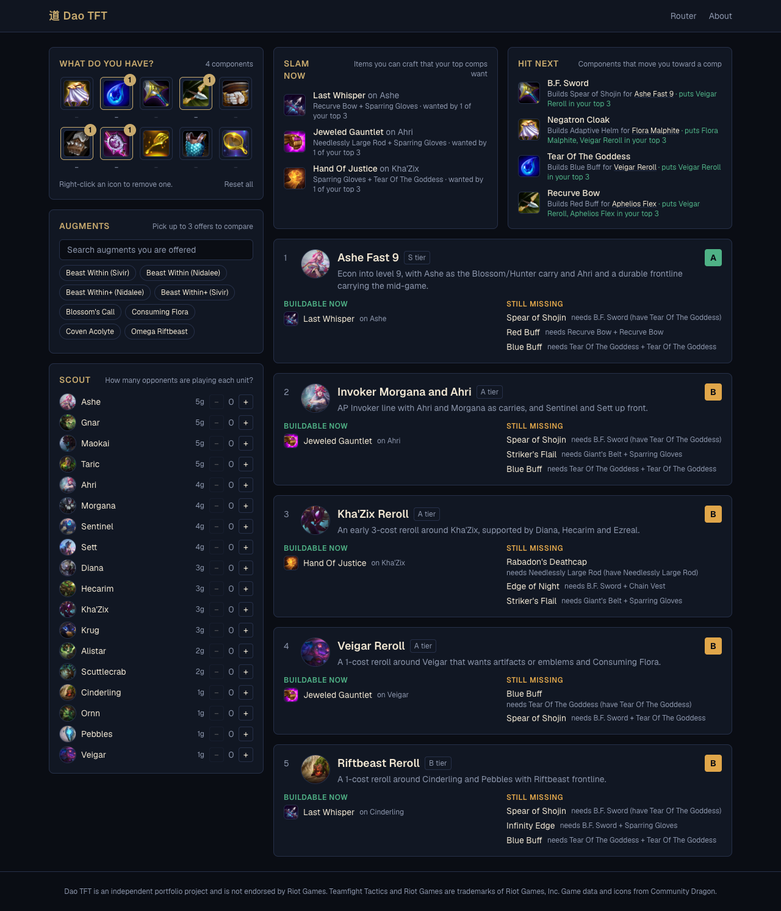

# Dao TFT

An early-game decision engine for Teamfight Tactics (Set 18). Most TFT tools answer *"what is the best final board?"* Dao TFT answers the question you have at 2-1: **given the item components I hold right now, what should I play toward, what should I slam, and what should I hope to hit next?**

**Live demo: https://dao-tft.vercel.app**



The site is a flowchart. Each step appears once the one before it is answered:

1. **Item components** you are holding.
2. **Your 2-1 board**: the units you are playing now.
3. **Your 2-1 augment**: compare the offers, then take one.

From there the flow branches into three information sections, then into the compositions to play:

- **Slam now**: completed items worth crafting for your top comps.
- **Hit next**: which component (carousel, creep round) moves you toward which comp.
- **Scout**: flag units opponents are playing; contested comps drop, and uncontested comps that reuse your items are suggested.
- **Compositions**: the top three, with what you can build now, what is missing, and why each ranked where it did. Augment offers flag **lock-ins** and **flex enablers**.

The PRD is in [`Dao_TFT_PRD.md`](Dao_TFT_PRD.md).

## Run it

```bash
npm install
npm run dev        # http://localhost:3000
npm test           # engine + data tests
npm run build      # also validates every comp against the data snapshot
npm run fetch-data # refresh src/data/snapshot.json from Community Dragon
npm run fetch-comps # refresh src/data/comps-tftacademy.json from TFT Academy's tier list
npm run fetch-items # refresh src/data/item-stats.json (artifact/emblem holders) from tactics.tools
```

## How the ranking works

Each curated comp lists the completed items it wants, weighted 1 (flex) to 3 (core). The problem is that every item **consumes two components**, so a comp's items compete for the same pool. A simple overlap score hides that, and it cannot tell you what to craft.

[`src/engine/allocate.ts`](src/engine/allocate.ts) solves it directly. It searches subsets of a comp's items, keeping only those the player's components can actually build, and picks the best:

```
value = Σ weight of crafted items + 0.35 × weight of each unbuilt item a leftover component still feeds
```

Infeasible branches are cut as soon as the pool runs out, and a bag holds a handful of components, so the search is tiny. Results are cached per comp and component set.

[`src/engine/router.ts`](src/engine/router.ts) turns that into a score:

```
score = (value / best possible value for n components) × tier weight
      + augment bonus + held item bonus + board bonus − scout penalty
```

**Items lead, the early board follows.** A held artifact or emblem also takes one of its wearer's item slots: the unit TFT Academy puts it on, or the comp carry tactics.tools rates highest with it. It fills whichever of that unit's items the components could least afford, so the comp's fit rises as if that item were built. On top of that, held artifacts and emblems that a comp does not already build pull toward it ([`src/engine/items.ts`](src/engine/items.ts)): +0.2 if TFT Academy builds the item in that comp, plus the placement gain tactics.tools measures for the item on the comp's carry (×0.6) or another end-board unit (×0.3), or +0.08 for an emblem whose trait the comp already runs. An item's best reason counts in full and agreeing reasons add half; one item adds at most 0.4 and all of them 0.45. The board adds at most 0.05 at levels 3-6, 0.1 at 7 and 0.15 from 8, because an early board is cheap to replace and items are not.

**Reroll comps need their carries.** A reroll comp (flagged `reroll` in its comp file, or set from the guide's style by `npm run fetch-comps`) whose carries are all missing from a non-empty board drops exactly one fit grade, however well the items suit it. An empty board is not penalised, since it says nothing yet.

**Augments steer the ranking.** Each comp lists the augments it wants in [`src/data/comp-augments.json`](src/data/comp-augments.json), each with a strength: `core` +0.3 (the comp is built around it, e.g. Unrivaled for Kha'Zix), `strong` +0.2 (a trait or carry augment the comp runs), `good` +0.1 (a solid pick TFT Academy recommends) or `avoid` −0.1. Every augment the player has taken that a comp lists adds its bonus, up to +0.5 in total. A comp an augment lifts clearly into first is tagged *lock-in*; one a strong pick lifts into the top three is a *flex enabler*.

Normalising by the best possible value for the number of components held means a comp with a long flex list is not punished. The same search drives the other features: *Slam now* is the items it chose to craft, and *Hit next* re-runs it with one extra component and reports the gain.

## Layout

```
src/engine/    pure TypeScript, no React: allocation, ranking, augments, scouting
src/data/      comp schema (zod), curated comps/*.json, TFT Academy comps, Community Dragon snapshot, validation
src/components, src/app, src/store   Next.js App Router UI, Zustand session state
scripts/       fetch-cdragon.ts builds the snapshot, fetch-tftacademy.ts converts TFT Academy comps, fetch-tactics-items.ts pulls item stats
```

The engine runs entirely in the browser, so results are instant and the whole site is static.

## Testing and CI

- **Allocation** is checked against a hand-worked example, plus property tests over random bags: it never spends a component twice, never gets worse when you add one, and never exceeds the optimistic bound.
- **Ranking, augments, scouting** have behaviour tests (lock-in, flex-enabler, penalty size, carry swaps).
- **Data validation**: every unit, item and augment in `src/data/comps/*.json` must exist in the Community Dragon snapshot. The check runs in tests *and* at build time, so a patch that removes a unit fails CI instead of shipping a stale comp.

GitHub Actions runs lint, typecheck, tests and the production build on every push.

## What is and is not here

This is an MVP built in a week, so it is deliberately narrow.

- Comps and item priorities are hand-curated from community guides (chiefly the BunnyMuffins Patch 18.3b guide). Their tiers follow TFT Academy's 18.4b tier list where it covers the comp; Aphelios Flex and Ashe Fast 9 keep their 18.3b tiers. They are editorial judgement, not statistics. Opener, slam and stage notes are short drafts.
- The rest of the comps are converted from [TFT Academy's tier list](https://tftacademy.com/tierlist/comps) by `npm run fetch-comps`. Boards, items and stage tips come from the guides; summaries and "play when" lines are generated from them, and Situational comps are listed as C tier. Comps the curated set already covers are skipped.
- Augment picks are hand-edited in `src/data/comp-augments.json`: TFT Academy's recommended augments for each guide, plus strengths judged from the guides' tips and comp names and from [SeeMeta's augment pages](https://seemeta.com/en/tft/set-18/augments). They are editorial, not measured lifts.
- Scouting is manual input only.
- **Not built**: patch history/selector, hex board view, flowchart visualisation, Riot API integration, desktop overlay, automatic PR on patch change.

## Updating augments after a patch

`src/data/comp-augments.json` is the only place augment picks live, and no script overwrites it. Each comp's list is keyed by its slug, one augment per line:

```json
"khazix-reroll": [
  {"augment": "DA_18_RivalsAugment", "strength": "core", "note": "Unrivaled powers up the Rival trait that Kha'Zix runs."},
  {"augment": "DA_ChampDelivery", "strength": "good"}
]
```

- `augment` is the Community Dragon id; search `src/data/snapshot.json` for the augment's name to find it.
- `strength` is `core`, `strong`, `good` or `avoid`. `note` is optional and shown on the recommendation card when the augment is taken; give one for every `core` and `strong` pick (a test checks).
- A comp lists at most 10 augments. Update `patch` and `checkedAt` when you review the file.
- `npm run fetch-comps` prints the augments TFT Academy recommends that the file is missing, and comps it does not cover yet, so you know what to add.
- The build fails on an unknown augment id, an augment listed twice for one comp, or a slug that matches no comp (for example after TFT Academy renames a guide).

## Disclaimer

Dao TFT is an independent portfolio project and is not endorsed by Riot Games. Teamfight Tactics and Riot Games are trademarks of Riot Games, Inc. Unit, item and augment data and icons are loaded from [Community Dragon](https://www.communitydragon.org/).
